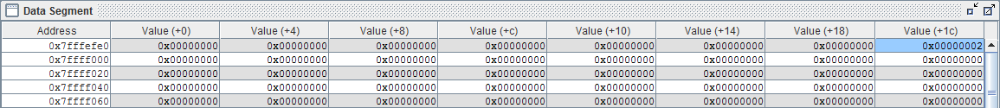

#README for Assembly Test

Our assembly program does some fun stuff.

We used 2 instructions outside of the list provided in the lab README. These were “li” and “la”.
The command “li” loads an immediate number into a register, while the “la” command loads a number into a register from another register. 

If you run the whole program, you should get the following values for these registers that our program changes:

Register | Value
-------|-------------- 
$t0 | 0x00000000
$t1 | 0x00000002
$t2 | 0x00000000
$t3 | 0x00000004
$t4 | 0x00000002
$t5 | 0xfffffffe
$t6 | 0x00000000
$t7 | 0x00000004
$s0 | 0x00000002
$s1 | 0x00000004
$s2 | 0x00000006

_Table 1: The final values of the registers after the full program is run._

If you run the program line by line, this is what should happen after each line:

Line 4: $t0 -> 1

Line 5: $t1 -> 2

Line 6: $t2 -> 3

Line 7: $t3 -> 4

Line 10: $t4 -> 3 when it adds $t0 and $t1 (1+2)

Line 11: $t5 -> 1 when it subtracts $t1 from $t2 (3-2)

Line 12: $t6 -> 0 because $t4 is not less than $t5

Line 13: $t7 -> 4 because it is loading the value from $t3

Line 14: $t0 -> 0 because we are loading from the stack pointer + 4 (which has not been set, so it’s zero)

Line 15: store the value of $t1 (2) to the stack pointer location (shown in the data segment section, far right, see picture)

_Figure 1: The blue highlighted box shows where the value of $t1 changes the stack pointer to 2_

Line 16: $t2 -> 0

Line 17: Branches if $t4 is not equal to 3, but the first time it runs, $t4 does equal 3, so it does not branch.

Line 18: Jumps to the jump location (line 9)

Line 10: Does the addition again $t4 -> 2  ($t0+$t1 = 0+2 =2)

Line 11: $t5 -> -2 (in hex, this will show up as 0xfffffffe) subtraction ($t2-$t1 = 0 - 2 = -2)

Line 12: $t6 stays 0 because $t4 is not less than $t5

Line 13: $t7 -> 4 because it is setting the value of $t3 to $t7

Lines 14 + 15: Nothing changes when we run lines 14 (load word) and 15 (store word) again.

Line 16: Nothing changes when we load 0 into $t2 again.

Line 17: Because $t4 no longer equals 3, we branch to branchlocation (line 20)

Line 21: $s0 -> 2 because we are XORing $t2 (b`00) with 2 (b`11). This is a bitwise XOR so all bits are different.

Line 22: Go to jumpandlinklocation, save $ra to be the line after jal was called (line 30)

Line 30: $s1 -> 4 because you are adding $t6 and $t7, which is 0 plus 4

Line 31: Jump register, return to the address saved in $ra (line 23)

Line 24: $s2 -> 6 because we added $s0 and $s1, which is 2 + 4

Line 27: $v0 -> 10 so that it exits when syscall is called

Line 28: syscall exits